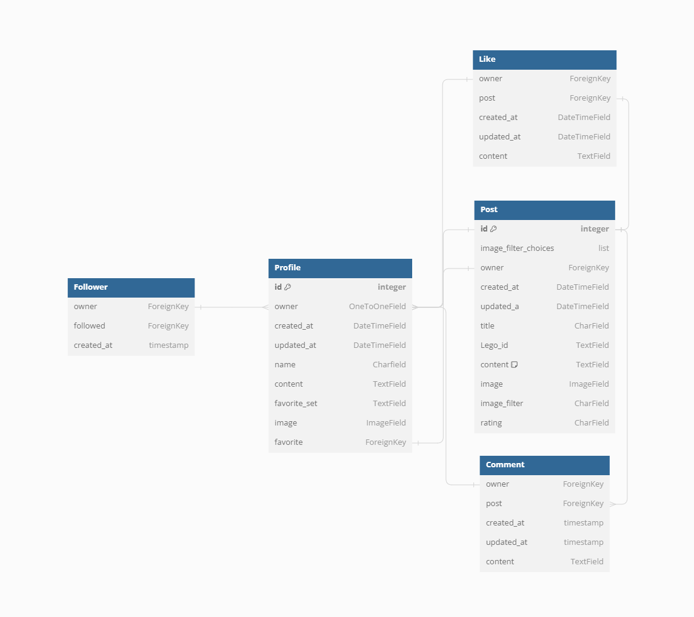

# My Lego Build

### [Live Website](https://lego-builds-284f09d1e728.herokuapp.com/)

A community wesite to share your Lego builds.  
Share your newest Lego set or custom build with the community. Other users can easily identify the Lego Set, like and comment on the post. With an easy process to signup and start adding posts of your own.

## Table of Contents
2
  3
    4
1. [User Experience (UX)](#user-experience-ux)
    1. [Strategy](#strategy)
        1. [Project Goals](#project-goals)
        2. [User Goals](#user-goals)
        2. [Main Technologies](#main-technologies)
        3. [Starting Board](#starting-board)
    2. [Structure](#structure)
        1. [Database Model](#database-model)
2. [Features](#features)
    1. [Nav Bar](#the-nav-bar)
    2. [Home Page](#home-page)
    3. [Post Page](#post-page)
    4. [Feed](#feed)
    4. [Liked](#liked)
    6. [Profile Page](#profile-page)
3. [Features Left to Implement](#features-left-to-implement)
4. [Testing](#testing)
4. [Credits](#credits)

***

## User Experience (UX)

### Strategy

#### Project Goals

* The website is built using a simple colour palate to both match Lego's aesthetic and for a modern and clean design.

* Responsive design to make the website accessible on different screen sizes and devices.

* The Website Structure is easy to understand and navigates smoothly.

* Site users are able to register an account to unlock ways to interact with the content.

* Site users are able to post their Lego Builds and comment on other builds, Follow, Like and Search for builds.

#### Main Technologies

  - [HTML](https://www.w3schools.com/html/)
  - [CSS](https://www.w3schools.com/css/default.asp)
  - [JavaScript](https://www.w3schools.com/js/default.asp)
  - [Python](https://www.w3schools.com/python/default.asp)
  - [GitHub](https://github.com/)

#### Libraries, Framworks and packages
  - [React](https://react.dev/)  
  React was used to build the Frontend
  - [NPM Installer](https://docs.npmjs.com/)  
  NPM was used to install packages and libraries
  - [React Bootstrap](https://react.dev/)  
  Used to create the layout of the website and some styling
  - [JWT Decode](https://react.dev/)  
  Used to access data in token between the Front and Back ends
  - [Whitenoise](https://react.dev/)  
  Whitenoise is used to store static files
  - [react-infinite-scroll-component](https://react.dev/)  
  Added to create infinite scrolling pages
  - [react-router-dom](https://react.dev/)  
  Used to enable the use of client side routing

#### User Goals
GitHub projects was used as my project management tool to track user stories. Using a Kanban board helped to focus on specific tasks and track the project progress. I used lables on the stories to priority of the feature.

[Features/Planning Board](https://github.com/users/EMarnus/projects/5)  

#### Starting Board
 

### Structure

#### Database Model

The database models were designed using [drawsql](https://drawsql.app/), based on the models used by the Moments Porject. The type of database being used for the is a relational database being managed using [PostgreSQL](https://www.postgresql.org/) and hosted on [ElephantSQL](https://www.elephantsql.com/).

#### Model Diagram
  

### Features  

#### The Nav Bar

  - Featured across top of the page.
  - If you're not logged you have the home link, Sign in link and the sign up link.  

  
  - If you are logged in you see the:  
   home link, that show all the post and top users and posts.   
   Add Post which lets you add a post.   
   Feed which shows you all the posts of users you have liked.   
   Likeed which shows you all the posts you have liked.  
   Sign out which signs you out.   
   Profile where you can view your profile.  
   
  

#### Home Page

  - Here you can see all the posts, initially loading 10 with infinite scroll.
  - there is a search bar to look for specific posts.
  - There are the top 4 most followed builders, you can click on the to view their profiles.
  - There are the top 3 most liked builds, can be clicked to view the full post.

  - As a logged in user you can like a post from here and follow one of the top builders.  

    

#### Post Page  

- The post page focuses on one build and allows you to leave a comment, you can also like from this page.
- Also includes the most popular builders.
- Top builds left off page due to this being the focus of a single build, don't want to distract from that.  

  

#### Feed  

- The Feed page is the same as the home page except the posts have been filtered by users that you have followed.  

#### Liked  

- The Liked page is the same as the home page except the posts have been filtered to only show posts that you have previously liked.  

#### Profile Page  

- The profile page gives you details about a specific user.
- You can see the users Bio if they have added one.
- You can see how many Posts they have made, how many followers they have and how many users they are following.
- You can follow the user from this page.
- And you have all the post made by the user, again 10 initial with infinite scroll.  

  

### Features Left to Implement

- Build Rating System
- Multiple Images and Reduce saved image size
- User Favourite on profile page
- ~~More~~ automated testing

## Testing 

Ongoing testing on Chrome as features were added. Additional Testing was done desktop Edge, Firefox & Mobile Chrome. Manual testing was done following this checklist [Checklist](https://docs.google.com/spreadsheets/d/1rDn5DmbLlz_En2615I5K9rNAyRvYyBaUJsMl6w5PJ_Q/edit?usp=sharing).

### Validator Testing 

- HTML - [W3C validator](https://validator.w3.org/)
    - Pages tested on W3C, only info given
- CSS - [(Jigsaw) validator](https://jigsaw.w3.org/css-validator/)
    - CSS tested and no problems found
- Python code was checked by running pycodestyle and pylint on all the apps. Unable to resolve pycodestyle on migration files.

### Lighthouse Resualts
- Sign In  

- Sign Up  

- Home  

- Profile  

- Add Post  

- Post  

### Fixed Bugs
- Search Broken [Fix Commit](https://github.com/EMarnus/Lego-Builds/commit/c8ff1f7e0cf9eacb12bc68c2870372991eed9422)
- Login Status occasionaly lost with page loading.
- Infinite Scrolling, found to be a gitpod issue after researching.

## Deployment

- The site was deployed using Heroku and the documentation from Code Institute for deploying a combined API and React Frontend: 

- [Combined Project Deplyment Documentation](https://code-institute-students.github.io/advfe-unified-workspace/creating-an-app-in-a-workspace/00-creating-an-app-in-a-workspace)

- Heroku
1. Log in to heroku.com and open the dashboard for your react application (remember this is separate from the DRF application that runs your API)
2. Select the “Deploy” tab in the dashboard
3. Scroll down to the bottom and then select “Deploy Branch”
4. Wait for your build to complete (you can click “view build log” to watch the process in a larger window)
5. When you see the message “deployed to Heroku” in the build log, click the “open app” button at the top of the page.

## Credits 
- Project is based on the Moments walkthrough Project by Code Institute.
- Logo sourced from [Logo](https://www.freepnglogos.com/images/lego-png-logo-3370.html)
- And as always with suport from CI's Slack communitey and Tutors, Stack Overflow, just an awesome site where you can find all the answers especially the ones you weren't looking for.
- My mentor for the project, Derek McAuley

### Content 
- Content written by developer, unless otherwise credited
- Logo sourced from [Logo](https://www.freepnglogos.com/images/lego-png-logo-3370.html)